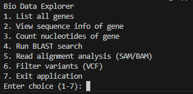
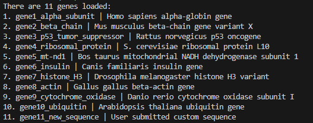
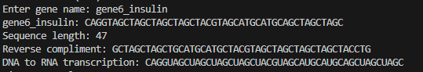
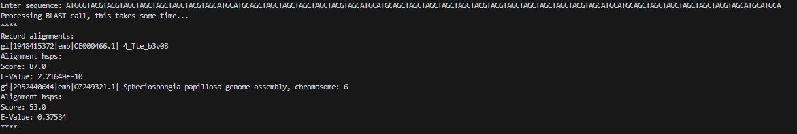
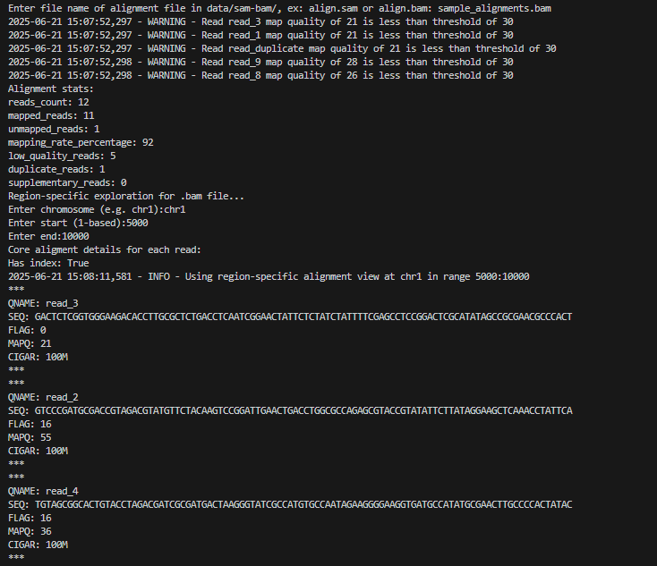
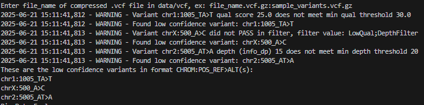

# bio-data-explorer

bio-data-explorer is a basic command-line tool for interactively exploring common bioinformatics file formats, including FASTA, FASTQ, SAM/BAM, and VCF. It also includes a built-in client for running BLAST searches against the NCBI database.

This project uses these bioinformatics libraries to help handle the data formats:

[pysam](https://pysam.readthedocs.io/en/latest/): SAM/BAM file processing and indexing  
[cyvcf2](https://github.com/brentp/cyvcf2): Fast parsing of compressed VCF files  
[Biopython](https://biopython.org/): BLAST result calls/parsing and FASTQ handling  

## Running locally

#### (For Windows Users Only) Step 1: Install WSL and Ubuntu

To run this project on Windows, you must use Windows Subsystem for Linux (WSL) to ensure proper dependency installation and smooth operation.

1. Open PowerShell as Administrator (right-click → Run as Administrator).
2. Run this command to install WSL and the Ubuntu Linux distribution: ```wsl --install```
3. Restart your computer if prompted.
4. Launch the Ubuntu app from your Start menu.
5. Complete the initial setup by creating a Linux username and password.

#### Step 2: Clone the repo

```
git clone https://github.com/yourusername/bio-data-explorer.git
cd bio-data-explorer
```

#### Step 2: Update packages and install Python 3.11 with dependencies

Inside the Ubuntu terminal, run:

```
sudo apt update
sudo apt install -y software-properties-common
sudo add-apt-repository ppa:deadsnakes/ppa
sudo apt update
sudo apt install -y python3.11 python3.11-venv python3.11-distutils python3.11-dev python3-pip build-essential libbz2-dev liblzma-dev libcurl4-openssl-dev libssl-dev
python3.11 --version
```

**Note for macOS users**:
Please install Python 3.11 and Xcode Command Line Tools before continuing. You can use Homebrew:

```
brew install python@3.11
xcode-select --install
```


After that, continue with the next steps below starting at **Step 3: Create and activate Python virtual environment**.


#### Step 3: Create and activate Python virtual environment

```
python3.11 -m venv .venv
source .venv/bin/activate
```

#### Step 4: Upgrade pip and install your package with dev dependencies

```
pip install --upgrade pip setuptools wheel
pip install numpy==1.26.4
pip install --no-binary=cyvcf2 cyvcf2
pip install .[dev]
```

#### Step 5: Run the CLI tool

Make sure your virtual environment is activated before running the CLI:

```source .venv/bin/activate```

Run with default sample data:

```bio-data-explorer-cli```

Run with your own input file:

```bio-data-explorer-cli data/fasta/your_file.fasta.gz```

If you ever want to run the CLI command without activating the venv, you can run it explicitly:

```.venv/bin/bio-data-explorer-cli```


#### Step 7: Run tests

```pytest```

#### (Optional) Adding Your Own Data

The app comes with sample files for each format, but you can also place your own data in the following folders:

- data/fasta/ → .fasta.gz
- data/fastq/ → .fastq.gz
- data/sam-bam/ → .sam / .bam
- data/vcf/ → .vcf.gz

## Example Screenshots

### Main CLI Menu



### List all genes



### View sequence info of gene



### Run BLAST search



### Read alignment analysis (SAM/BAM)



### Filter variants (VCF)


